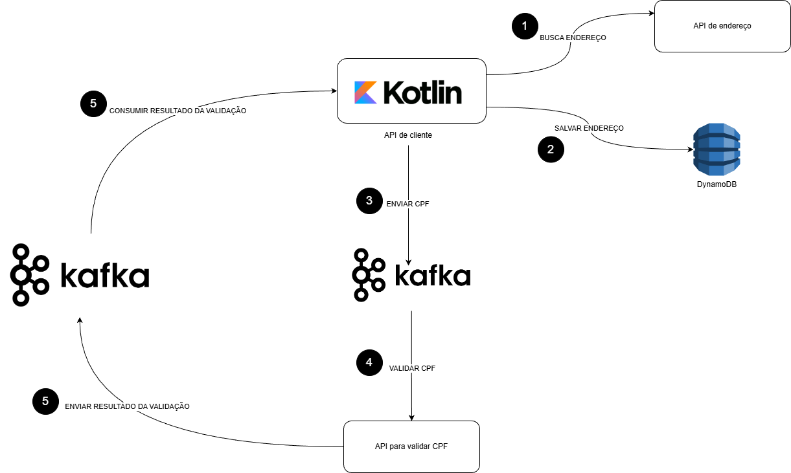

# Documentação do Projeto

## Descrição Geral

Este projeto utiliza a arquitetura hexagonal e é desenvolvido em Kotlin, com suporte a Java e Maven. Ele integra serviços como DynamoDB (via LocalStack), Kafka e WireMock para simulação de APIs externas.  
Criado durante o curso [Arquitetura Hexagonal com Kotlin NA PRÁTICA](https://www.udemy.com/course/arquitetura-hexagonal-com-kotlin-na-pratica/), mas com algumas alterações como o banco utilizado aqui é o DynamoDB ao invés do MongoDB.

---

## Componentes do Sistema

- **Adapters**: Camadas de entrada e saída para comunicação com APIs externas, banco de dados e mensageria.
- **Use Cases**: Contêm a lógica de negócio principal.
- **Ports**: Interfaces que conectam os casos de uso aos adapters.
- **Configurações**: Beans e configurações para integração com DynamoDB, Kafka e outros serviços.

---

## Diagrama



## Pré-requisitos

### Ferramentas Necessárias
- Docker e Docker Compose
- Java 17+
- Maven
- Insomnia ou Postman para testes de API

### Comandos Úteis

#### Listar tabelas no DynamoDB:
```bash
aws dynamodb list-tables --endpoint-url http://localhost:4566
```

#### Inserir um item na tabela:
```bash
aws dynamodb put-item --table-name tb_customer --item '{"id": {"S": "test-id"}, "name": {"S": "Test Name"}, "cpf": {"S": "12345678900"}}' --endpoint-url http://localhost:4566
```

#### Consultar itens na tabela:
```bash
aws --endpoint-url=http://localhost:4566 --region sa-east-1 dynamodb scan --table-name tb_customer
```

---

## Passo a Passo para Execução

### 1. Subir os Serviços com Docker

Certifique-se de estar na pasta local e execute:
```bash
docker-compose up -d
```

**Serviços que serão iniciados:**
- **Kafka**: Porta 9092
- **LocalStack (DynamoDB)**: Porta 4566
- **WireMock**: Porta 8082

### 2. Configurar o DynamoDB

O script `init-dynamodb.sh` já cria a tabela `tb_customer` automaticamente ao subir o LocalStack.

### 3. Rodar a Aplicação

Execute o seguinte comando na raiz do projeto:
```bash
mvn spring-boot:run
```

### 4. Testar as Funcionalidades

Utilize o Insomnia ou Postman para realizar requisições:

#### Buscar Endereço por CEP:
- **Método**: GET
- **URL**: `http://localhost:8082/addresses/{zipCode}`
- **Exemplo de CEP**: `38400000`

#### Inserir Cliente:
- **Método**: POST
- **URL**: `http://localhost:8080/customers`
- **Body (JSON)**:
```json
{
  "name": "João Silva",
  "cpf": "12345678900",
  "zipCode": "38400000"
}
```

### 5. Monitorar Logs

Verifique os logs da aplicação para garantir que as operações estão sendo realizadas corretamente:
```bash
docker logs -f <container_name>
```

---

## Próximos Passos

- Tratar exceções como "Customer not found" para retornar mensagens amigáveis ao cliente.
- Expandir os testes automatizados para cobrir mais cenários.
